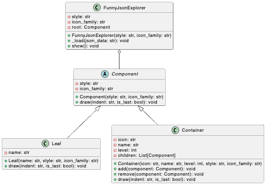

# Funny JSON Explorer 设计文档

计算机学院                  计算机科学与技术                  刘佳瑜                    21311592

本项目构建了Funny JSON Explorer（**FJE**），一个JSON文件可视化的命令行界面小工具。通过在终端运行指令，可以指定可视化的风格和图标类型，对JSON文件进行可视化。

源代码：

## 类图

## 类说明

### Component

`Component` 类是一个抽象类，定义了所有组件（叶子节点和容器节点）共有的属性和方法。

- **属性**

  - `style`：表示可视化风格（例如，tree 或 rectangle）。
  - `icon_family`：表示图标族（例如，poker-face 或 star）。
- **方法**

  - `draw(indent: str, is_last: bool)`：抽象方法，子类必须实现，用于绘制组件。

### Leaf

`Leaf` 类继承自 `Component`，表示 JSON 数据结构中的叶子节点。

- **属性**

  - `name`：叶子节点的名称。
- **方法**

  - `draw(indent: str, is_last: bool)`：实现了 `Component` 类的抽象方法，用于绘制叶子节点。

### Container

`Container` 类继承自 `Component`，表示 JSON 数据结构中的容器节点，可以包含其他 `Component` 对象（包括 `Leaf` 和 `Container`）。

- **属性**

  - `icon`：容器节点的图标。
  - `name`：容器节点的名称。
  - `level`：容器节点的层级。
  - `children`：包含的子组件列表。
- **方法**

  - `add(component: Component)`：添加子组件。
  - `remove(component: Component)`：移除子组件。
  - `draw(indent: str, is_last: bool)`：实现了 `Component` 类的抽象方法，用于绘制容器节点及其子组件。

### FunnyJsonExplorer

`FunnyJsonExplorer` 类用于加载和展示 JSON 数据，通过解析 JSON 数据构建组件树，并调用根节点的 `draw` 方法来展示整个结构。

- **属性**

  - `style`：表示可视化风格。
  - `icon_family`：表示图标族。
  - `root`：根组件。
- **方法**

  - `_load(json_data: str)`：加载 JSON 数据并构建组件树。
  - `show()`：展示组件树。

## 设计模式及其作用

### 组合模式（Composite Pattern）

在 `FunnyJsonExplorer` 项目中，使用了组合模式来表示 JSON 数据的层次结构。

- **Component（组件）**：定义了所有组件共有的接口或抽象类，包括基本属性（如 `style` 和 `icon_family`）和方法（如 `draw`）。
- **Leaf（叶子节点）**：实现了 `Component` 接口，表示树的叶子节点，即没有子节点的对象。
- **Container（容器节点）**：实现了 `Component` 接口，表示树的容器节点，可以包含其他 `Component` 对象（包括 `Leaf` 和 `Container`）。
